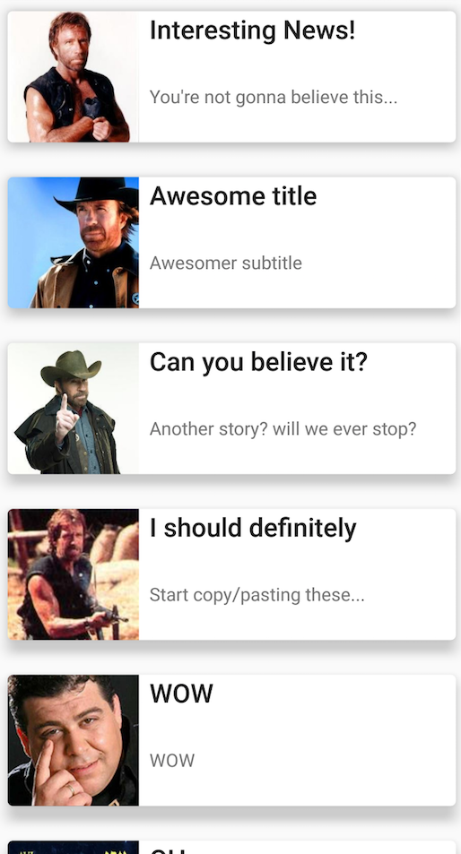

# iOS Home Assignment

## Overview

Welcome to our iOS Home assignment. We're going to walk you through the contents of this repository while providing the requirements we ask for, as part of the submission. please read through carefully.

## Contents

This repo contains a bootstrap project in which we request to do the assignment.

## Installation

Simply clone the repo and launch the existing project file using your Xcode.
The project is buildable, runnable & ready to receive specific implementation details.

## Requirements

* While adding new files / classes, we'd like to see those added in ```Swift```
* Make sure there is a clear separation between your View, Presentation and Model layers: we appreciate using one of the MV* patterns wisely
* We are not only looking for a working solution, but we review code best practices and the overall experience
* Feel free to use any Open Source project you know that could help with the task, as long as you trust it

## Specifications
* The app should fetch remote data from several sources and display the results in a Table/Collection View
* Each source returns a different format of JSON data, containing a list of items
* Each endpoint can return **more than one result**.
* Each item in the list contains an image url, title and a subtitle/text, in some different form of structure, but is promised to being eligable for display in our UI requirements
* The cells or their content objects should be properly reused
* Each cell in the Table/Collection view should include an image, title & a subtitle which should be populated from the data  fetched
* The data should be aggregated, parsed and presented to the UI
* The UI should update with results **only when all data sources returned their response** (a loader aniamtion is welcomed here)
* Add a caching layer for each data source. 
  * Cache time to live:
      * Source A - 5 min
      * Source B - 30 min
      * Source C - 60 min  
 * We've pre-built a  ```Constants``` class which describes the available sources and their respectful URLs
 * Make sure that your code can be scalable in the future – for example if we would like to add another source , we want to do it easily without a lot of overhead or risk

##### Data source A:
Json sample:
```json
{
  "stories": [
    {
      "title": "Interesting News!",
      "subtitle": "You're not gonna believe this...",
      "imageUrl": "https://pbs.twimg.com/profile_images/658218628127588352/v0ZLUBrt.jpg"
    }
    ...
    ]
}
```

##### Data source B:
The relevant fields here are "header", "description" and "picture".

```json
 {
   "metadata": {
     "this": "isnotimportant",
     "innerdata": [
       {
         "aticleId": 1,
         "articlewrapper": {
           "header": "WOW",
           "description": "SHIGAON"
         },
         "picture": "https://pbs.twimg.com/profile_images/2084187780/avib_400x400.jpg"
       }
       ...
       ]
   }
 }            
```
    
##### Data source C:
subtitle here is a concatintation of subLine1 + subLine2.

```json
[
  {
    "topLine": "Latest article",
    "subLine1": "And here is the ",
    "subline2": "subtitle!",
    "image": "http://c-sf.smule.com/s25/arr/1d/4c/f0cf4342-e875-4601-b47e-c74a8d021d8d.jpg"
  }
  ...
]
```

### Example
This is a suggestion on how you can design the UI, but we leave it up to you to decide





